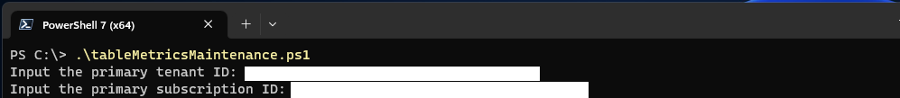
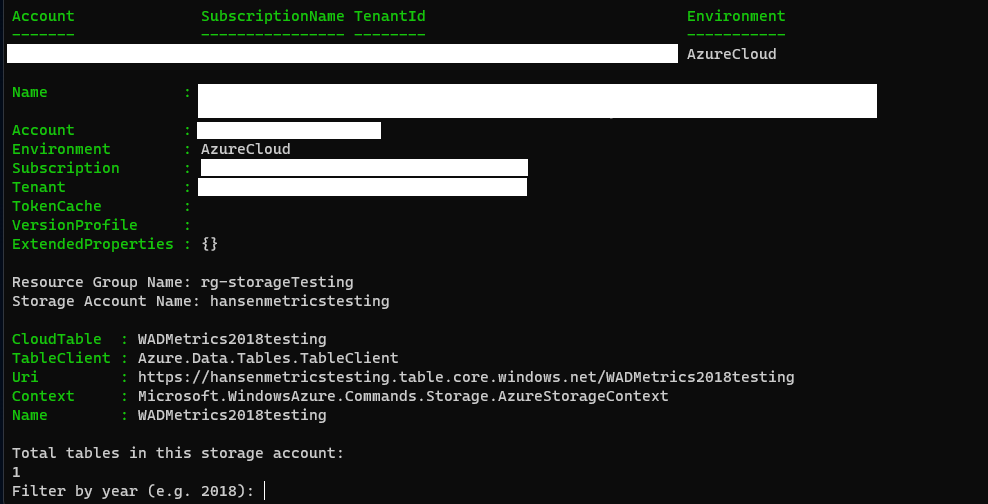
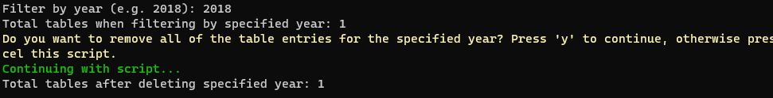

# Azure VM Diagnostic Metric Pruning
This repo has a script that automates mass pruning of old Azure VM Diagnostic Metrics data in Azure Table Storage. Across a fleet of VMs that are running for multiple years, diagnostic metrics can consume significant table storage capacity. This script is targeted at clearing a year's-worth of those metrics at a time for a particular storage account.

I have personally run this against a storage account used by a single VM and cleared almost 300 GB of storage from metrics that I no longer need to store.

**Prerequisites:**

1. Tenant ID
2. Subscription ID
3. Resource Group Name
4. Storage Account Name

## Contributing

Contributions are welcome, please submit an issue or PR!

## Disclaimer

This script is provided as-is without any warranty or support. Use this script at your own risk. I am not responsible for any damages or data loss that may occur as a result of running this script. Before running this script, make sure to read and understand the code, and test it in a non-production environment.
